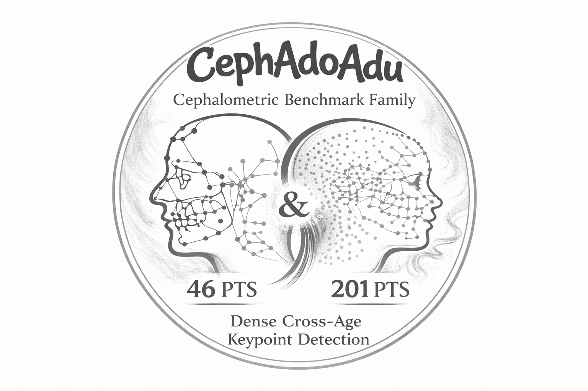
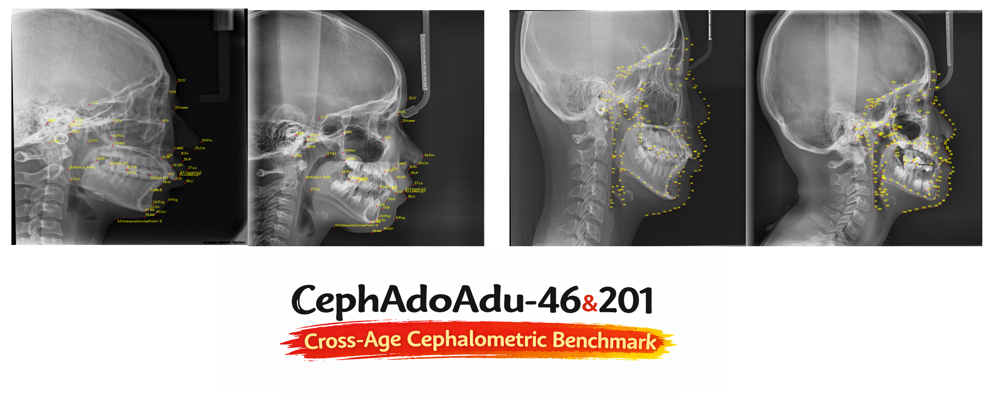

<h1 align="center">CeLDA+ & CephaAdoAdu</h1>

<p align="center">
  <a href="https://visitor-badge.laobi.icu/badge?page_id=ShanghaiTech-IMPACT.CeLDA_plus">
    
  </a>
  <a href="https://github.com/ShanghaiTech-IMPACT/CeLDA_plus/stargazers">
    
  </a>
</p>

<p align="center">
  
</p>

## 📄 Paper

> **CeLDA+: Prototypical Learning for Age-Robust Cephalometric Landmark Detection**<br/>

> [Han Wu](https://hanwu.website/)<sup>1*</sup>, [Wei Jia](https://github.com/WeiJiaFiona)<sup>1*</sup>, Lanzhuju Mei<sup>1</sup>, Tong Yang<sup>4</sup>, Haizhen Li<sup>3</sup>, [Chong Wang](https://cwangrun.github.io/)<sup>2✉</sup>, [Zhiming Cui](https://shanghaitech-impact.github.io/)<sup>1✉</sup> <br/>
> <sup>1</sup> School of Biomedical Engineering & State Key Laboratory of Advanced Medical Materials and Devices, ShanghaiTech University, Shanghai, China <br/>
> <sup>2</sup> Department of Radiology, Stanford University, Stanford, CA, USA <br/>
> <sup>3</sup> Shanghai Ninth People Hospital, School of Medicine, Shanghai Jiao Tong University, Shanghai, China <br/>
> <sup>4</sup> Shanghai Linkedcare Information Technology Co., Ltd., Shanghai, China <br/>
> <sup>*</sup> Equal contribution. ✉ Corresponding authors.

Accurate cephalometric landmark detection is essential for orthodontic diagnosis. However, existing methods predominantly focus on adults and overlook adolescents, whose developmental variations, such as unerupted teeth and mixed dentition, introduce substantial appearance changes and degrade detection performance. A unified framework that generalizes across age groups therefore remains lacking. To address this challenge, we propose CeLDA+ (**Ce**phalometric **L**andmark **D**etection across **A**ges), a prototypical learning framework for age-robust landmark detection. Rather than relying on highly variable local appearances, it formulates landmark detection as semantic matching in a high-dimensional feature space. By mapping morphologically diverse instances to compact regions around their prototypes, the model learns age-invariant representations without explicit age-specific designs. We further introduce two modules: Prototype Geometry Regularization, which enforces geometric consistency among landmarks, and Prototype Relation Mining, which captures semantic dependencies between anatomically related structures. For comprehensive evaluation, we construct two large-scale, multi-center datasets annotated with 46 and 201 landmarks, comprising 2,950 samples in total and representing the largest cephalometric benchmarks to date. Experiments on three benchmarks, including two cross-age and one adult-only dataset, show that CeLDA+ consistently outperforms prior state-of-the-art methods while maintaining the lowest computational cost. CeLDA+ also generalizes well to two downstream clinical evaluations: skeletal classification, following prior benchmark practice, and cephalometric tracing analysis, newly introduced in this work to provide contour-level evaluation for cephalometric landmark detection. These findings further highlight its applicability in real-world orthodontic scenarios.

<p align="center">
  
</p>

## 📰 News

- **[2026.03]** Code Commit
- **[2026.04]** Paper Submission

## 💡 Contribution

- **Methodological innovation:** Enhanced prototypical network with learnable landmark prototypes dynamically optimized during training for stronger age-robust representation.
- **Architectural advancement:** Prototype Geometry Regularization explicitly enforces anatomical spatial constraints and complements Prototype Relation Mining.
- **Large-scale benchmark datasets:** Two clinical benchmarks are released with 46 and 201 landmarks from 8 centers, totaling 2950 samples.
- **Clinical validation and deployment analysis:** Evaluated on deployment feasibility and downstream skeletal diagnosis; demonstrates clinically meaningful performance with strong inference efficiency.

## 📚 Dataset Information

Our CephaAdoAdu46/201 dataset is available for research purpose only. To apply for the dataset, please refer to the [dataset website of IMPACT Lab](https://shanghaitech-impact.github.io/dataset/), fill out the [application form](https://shanghaitech-impact.github.io/assets/dataset_application.pdf), and send the **signed e-copy** to Han Wu (wuhan2022@shanghaitech.edu.cn) and Dr. Zhiming Cui (cuizhm@shanghaitech.edu.cn), and **CC your advisor** as required in Sec.5 of the form. We will send the dataset link and password after receiving the registration form.


Expected data organization:

```text
data/CephaAdoAdu{46,201}
├── train/  (*.jpg + train_anno.json)
├── val/    (*.jpg + val_anno.json)
└── test/   (*.jpg + test_anno.json)
```

Landmark definitions:
- 46 points: [`data/46pts_definition.json`](data/46pts_definition.json)
- 201 points: [`data/201pts_definition.json`](data/201pts_definition.json)

<div align="center">
  
</div>

## 💻 Code

Code coming soon.
